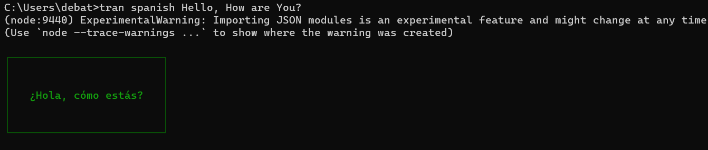

# Tran CLI Tool

`tran` is a command-line tool to translate sentences from English to various languages using the Google Translate API.

## Installation

1. Clone the repository:
    ```bash
    git clone https://github.com/Debatreya/tran-CLI.git
    ```

2. Navigate to the project directory:
    ```bash
    cd tran-cli
    ```

3. Install dependencies:
    ```bash
    npm install
    ```

4. Make the CLI globally available:
    ```bash
    npm link
    ```

## Usage

### Basic Usage

```bash
tran <lang_name> sentence to be translated
```

### Options

- `-l`, `--languages`: List all supported languages.
- `--help`: Show help.

### Examples

#### Translating a Sentence

```bash
tran spanish Hello, how are you?
```

#### Listing Supported Languages

```bash
tran -l
```


## Screenshots



## Demo Video

[If Video not visible, Click Here](./assets/videos/20240722-0922-51.2006360.mp4)

<video src="./assets/videos/20240722-0922-51.2006360.mp4" alt="Demo Video" controls></video>

## License

This project is licensed under the MIT License. See the [LICENSE](LICENSE) file for details.

## Contributing

1. Fork the repository.
2. Create your feature branch (`git checkout -b feature/YourFeature`).
3. Commit your changes (`git commit -am 'Add some feature'`).
4. Push to the branch (`git push origin feature/YourFeature`).
5. Open a pull request.

## Acknowledgements

- [Google Translate API](https://www.npmjs.com/package/@vitalets/google-translate-api)
- [yargs](http://yargs.js.org/)

## Contact

For any questions or suggestions, please contact [your email].

```
